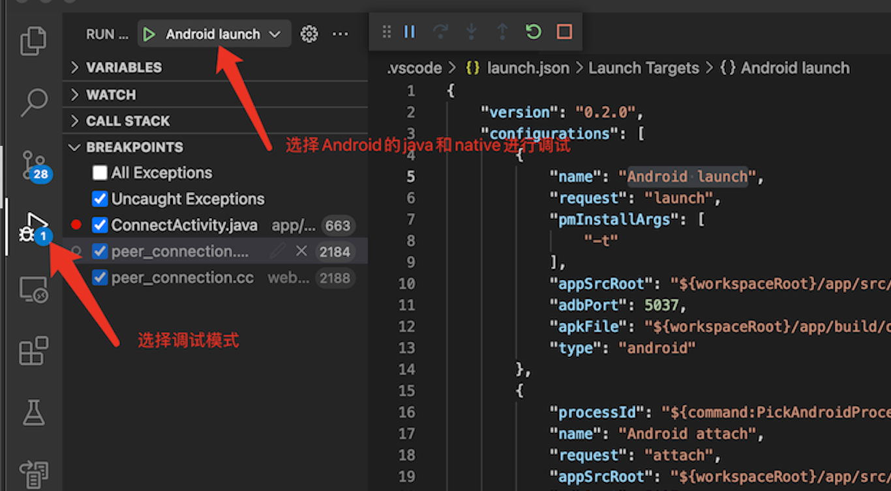
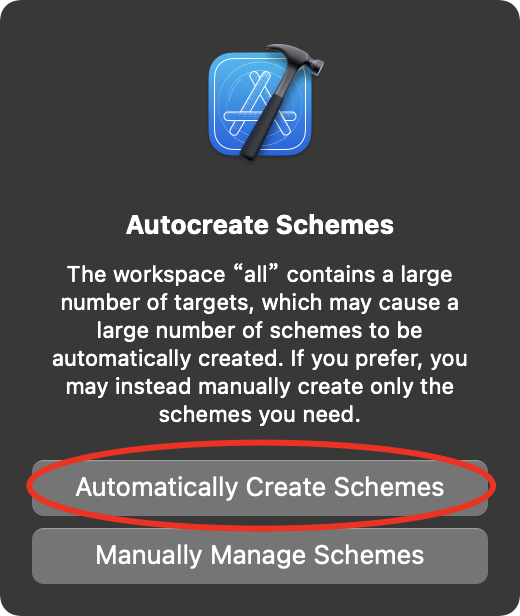
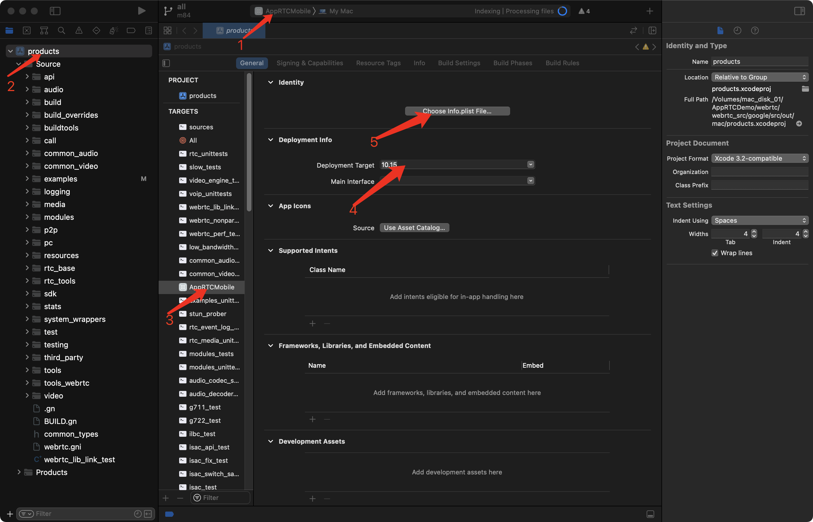
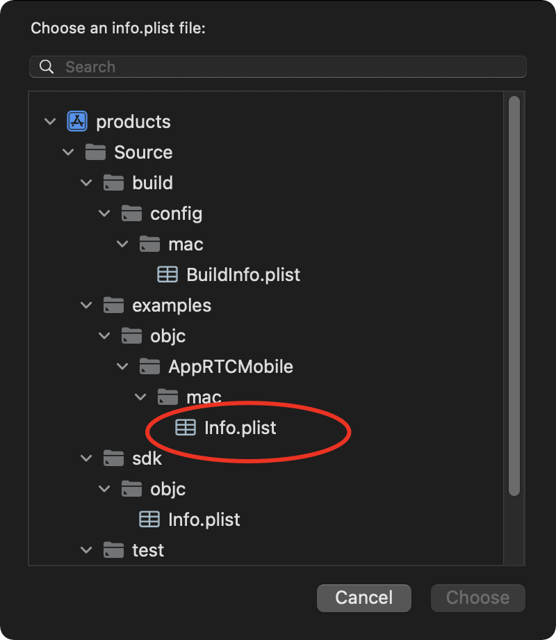
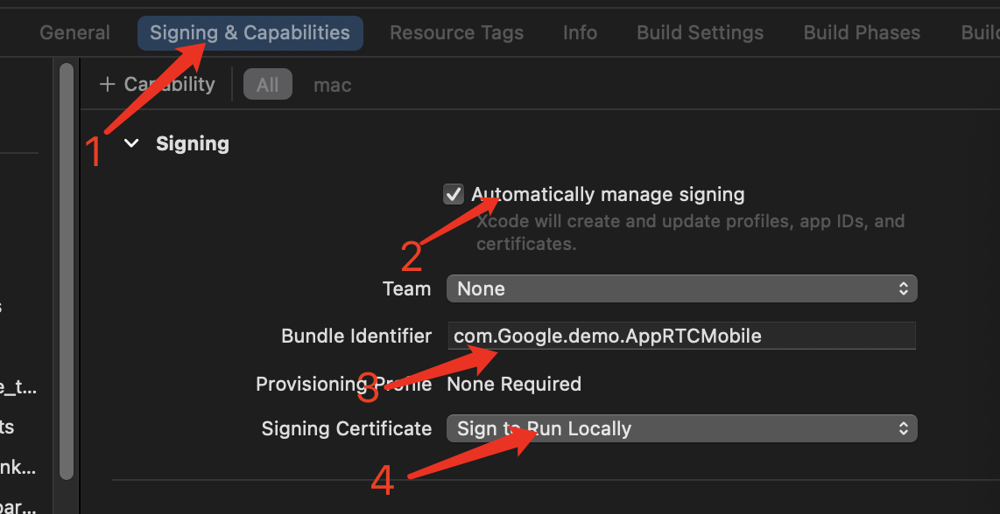
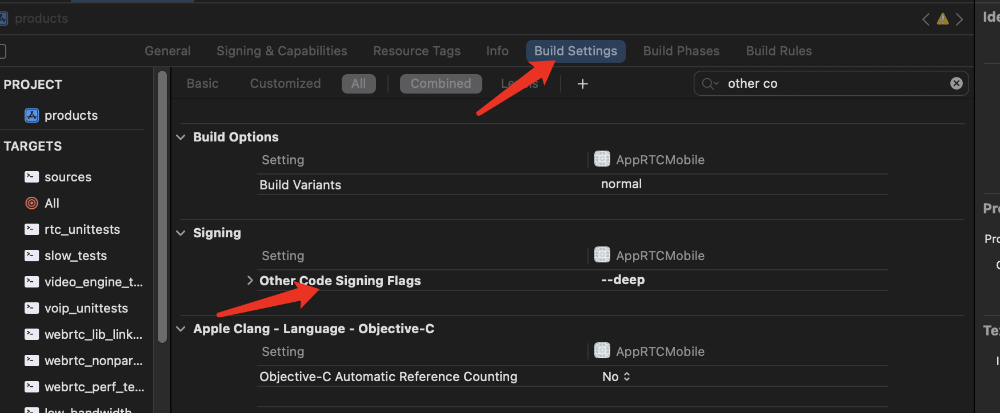

### WebRTC Android的c++源码在mac调试项目 调试方式来源于[WebRTC 学习指南](https://webrtc.mthli.com/basic/webrtc-breakpoint/)和[Flutter Engine C++ 源码调试初探_7. VSCode中使用LLDB调试](https://fucknmb.com/2019/12/06/Flutter-Engine-C-%E6%BA%90%E7%A0%81%E8%B0%83%E8%AF%95%E5%88%9D%E6%8E%A2/),而编译方式和服务器搭建来源于[WebRTC Native 开发实战(许建林)](https://item.jd.com/12939784.html)
<br>

### 编译和服务器搭建都是基于[docker](https://www.docker.com/)  
<br>

### 拉取源码和编译在webrtc目录下用终端执行
构建镜像
```
./build_image.sh
```
拉取WebRTC源码
```
./webrtc_gclient_sync.sh #默认用声网源,要使用Google的源要追加google参数 例如: ./webrtc_gclient_sync.sh google
```
如果使用声网源会提示 OK to update it to https://chromium.googlesource.com/chromium/tools/depot_tools.git ? [Y/n] 要输入 n  
<mark>如果使用Google源而且开了代理,要配置boto.txt文件,默认代理端口使用了privoxy默认端口的8118,不一样请进行修改</mark>

```
[Boto]
proxy = 127.0.0.1
proxy_port = 8118 #代理端口
```

如果结合[WebRTC Native 开发实战(许建林)](https://item.jd.com/12939784.html)进行学习最好切换30432的提交并且进行同步
```
cd ./webrtc_src/agoralab/src #如果使用声网源目录就是agoralab,如果Google就是./webrtc_src/google/src
git checkout be99ee8f17f93e06c81e3deb4897dfa8253d3211 -b commit_30432
//或者切换m84
git checkout branch-heads/4147 -b m84
//或者切换m84
git checkout branch-heads/4638 -b m95
cd ../../..
./webrtc_gclient_sync.sh
```

### 编译
### Android编译
创建临时容器并且在进入容器bash环境执进入编译,<mark>默认使用mac的酸酸乳进行代理端口是1087,不一样进行修改</mark>
```
./webrtc_build.sh 
```
webrtc_build.sh有下载源和是否开启代理2个参数,默认值分别是agoralab proxy-on,如果用Google源和不用代理proxy-off 就是下面命令
```
./webrtc_build.sh google proxy-off
```

如果第一次在容器运行先拉取Linux环境编辑工具
```shell
./gclient_sync.sh
```


脚本已经unstrip直接执行打包,会提示ERROR:root:Missing licenses的协议生成错误这个可以不用处理只要生成libjingle_peerconnection_so.so就行,最后libjingle_peerconnection_so.so在<mark>webrtc-build/webrtc_android/src/out/arm64-v8a</mark>  
```
cd /webrtc
./build_android.sh
```
<br> 


### Android调试
先将libjingle_peerconnection_so.so复制到webrtc/prebuilt_libs/arm64-v8a(如果目录不存在自行创建),然后参考[WebRTC 学习指南](https://webrtc.mthli.com/basic/webrtc-breakpoint/)获取so相对c++源码的链接地址,也可以直接用Android studio进行调试,但是c++因为没办法导入生成索引没法进行代码跳转,所以java层用Android studio调试,而c++改用[vscode](https://code.visualstudio.com/)调试思路是按照[Flutter Engine C++ 源码调试初探_7. VSCode中使用LLDB调试](https://fucknmb.com/2019/12/06/Flutter-Engine-C-%E6%BA%90%E7%A0%81%E8%B0%83%E8%AF%95%E5%88%9D%E6%8E%A2/)和[他的flutter_lldb脚本](https://github.com/lizhangqu/flutter_lldb.git)进行改造实现的  
<br>
需要安装以下插件  
[C/C++ for Visual Studio Code](https://marketplace.visualstudio.com/items?itemName=ms-vscode.cpptools)  
[CodeLLDB](https://marketplace.visualstudio.com/items?itemName=vadimcn.vscode-lldb)  
[Android](https://marketplace.visualstudio.com/items?itemName=adelphes.android-dev-ext)  

然后用vscode打开AppRTCDemo目录先手动或者用vscode的Android launch启动app,然后执行start_lldb.sh脚本  
start_lldb.sh有下载源参数,默认值分别是agoralab,如果用Google源下载源码 就是下面命令
```shell
./start_lldb.sh google
```
<mark>第一次使用可能需要修改脚本的 --remote-src-path=../../../ 改为地址为so的软连接,如果按上面步骤打包应该不需要修改</mark>   
然后在vscode选择debug_native启动c++调试,基本每次杀死app都跑start_lldb.sh脚本重启定位pid开启lldb-server

<br>   
<br>  

### Android c++使用CLion调试
1. 安装
```shell
brew install ninja cmake
```


### mac编译运行
1. 复制 /Applications/Xcode.app/Contents/Developer/Platforms/MacOSX.platform/Info.plist到别的目录
用xcode进行修改MinimumSDKVersion为10.12,
然后复制回/Applications/Xcode.app/Contents/Developer/Platforms/MacOSX.platform覆盖原来,
下载[MacOSX10.12.sdk](https://github.com/phracker/MacOSX-SDKs/releases)
复制到/Applications/Xcode.app/Contents/Developer/Platforms/MacOSX.platform/Developer/SDKs
2. 必须在Python2.7.x,如果终端是输入 python --version 不是2.7.x需要切换成2.7.x
3. 在AppRTCDemo/webrtc/webrtc_src/google  (google是镜像名) 第一次运行mac需要重新同步获取mac编译环境工具
    ```shell
    ./gclient_sync.sh
    ```
4. 在AppRTCDemo/webrtc/webrtc_src/google/src/examples/BUILD.gn  (google是镜像名) 在
    ```
    if (is_mac) {
        rtc_library("AppRTCMobile_lib") {
    ```
下面追加 PRODUCT_BUNDLE_IDENTIFIER 生成唯一包名
    ```
          extra_substitutions = [
            "PRODUCT_BUNDLE_IDENTIFIER=com.Google.demo.AppRTCMobile",
          ]
    ```
4. 在AppRTCDemo/webrtc/webrtc_src/google/ (google是镜像名)下执行
    ```shell
    ./generate_mac_ide.sh
    ```
    生成xcode项目配置
5. 在AppRTCDemo/webrtc/webrtc_src/google/src/out/mac目录下生成all.xcworkspace
6. 选择Automatically Create Schemes 
7.    
      1. 选择  AppRTCMobile 
      2. 选择 products 
      3. 选择 目标 AppRTCMobile
      4. 选择 macSDK版本为 10.15
      5. 选择 AppRTCMobile 的 Info.plist
         
      6. 选择 Signing & Capabilities
         然后按图片步骤在第三步填入 配置BUILD.gn的PRODUCT_BUNDLE_IDENTIFIER
         
      7. 选择 Build Settings 在 Other Code Signing Flags 添加 --deep
         
8. 最后在xcode直接编译和启动程序         
### 启动服务器
直接执行项目下的webrtc_server.sh脚本,而且调试项目默认是本机所在局域网的ip,如果服务器不是在本机运行,自行修改build.gradle脚本的pref_room_server_url_default参数值,不过注意运行过一次默认会保存上一次地址
```
./webrtc_server.sh
```

## License

```
Copyright (c) 2021, Matthew Lee
Copyright (c) 2015 - 2021, Taehyun Park
Copyright (c) 2011 - 2021, The WebRTC project authors.
All rights reserved.

Redistribution and use in source and binary forms, with or without
modification, are permitted provided that the following conditions are met:

1. Redistributions of source code must retain the above copyright notice, this
   list of conditions and the following disclaimer.

2. Redistributions in binary form must reproduce the above copyright notice,
   this list of conditions and the following disclaimer in the documentation
   and/or other materials provided with the distribution.

3. Neither the name of the copyright holder nor the names of its
   contributors may be used to endorse or promote products derived from
   this software without specific prior written permission.

THIS SOFTWARE IS PROVIDED BY THE COPYRIGHT HOLDERS AND CONTRIBUTORS "AS IS"
AND ANY EXPRESS OR IMPLIED WARRANTIES, INCLUDING, BUT NOT LIMITED TO, THE
IMPLIED WARRANTIES OF MERCHANTABILITY AND FITNESS FOR A PARTICULAR PURPOSE ARE
DISCLAIMED. IN NO EVENT SHALL THE COPYRIGHT HOLDER OR CONTRIBUTORS BE LIABLE
FOR ANY DIRECT, INDIRECT, INCIDENTAL, SPECIAL, EXEMPLARY, OR CONSEQUENTIAL
DAMAGES (INCLUDING, BUT NOT LIMITED TO, PROCUREMENT OF SUBSTITUTE GOODS OR
SERVICES; LOSS OF USE, DATA, OR PROFITS; OR BUSINESS INTERRUPTION) HOWEVER
CAUSED AND ON ANY THEORY OF LIABILITY, WHETHER IN CONTRACT, STRICT LIABILITY,
OR TORT (INCLUDING NEGLIGENCE OR OTHERWISE) ARISING IN ANY WAY OUT OF THE USE
OF THIS SOFTWARE, EVEN IF ADVISED OF THE POSSIBILITY OF SUCH DAMAGE.
```
